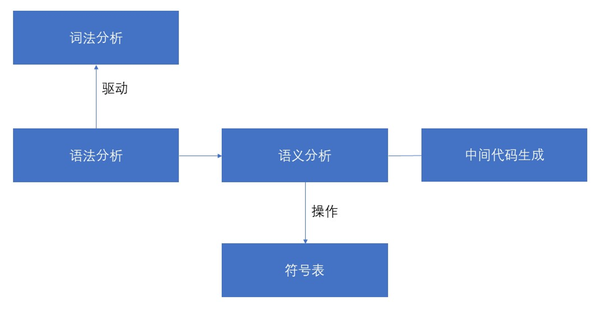
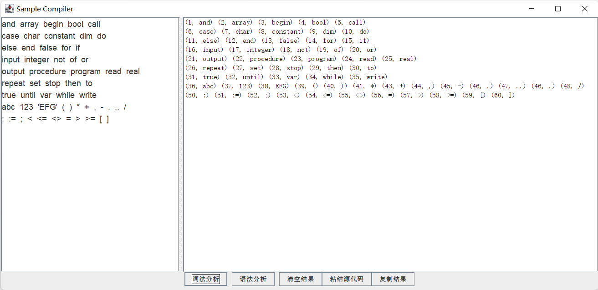
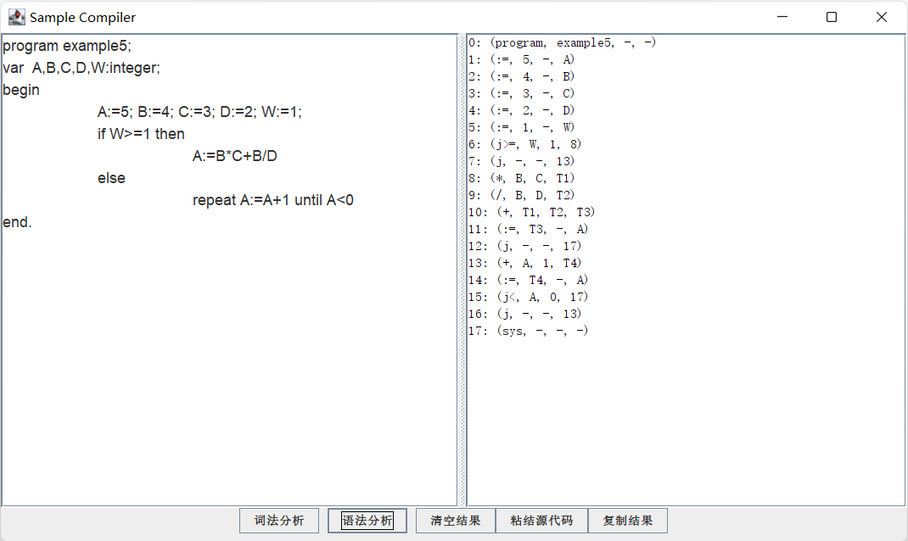
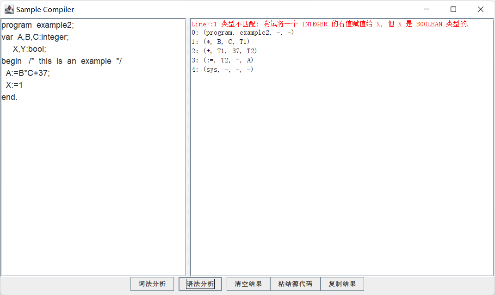

# Sample-Compiler

Sample语言编译器，使用手工构造的LL(1)分析，将Sample语言编译生成中间代码（四元式）。目前提供命令行版本和GUI版本。

编译器是使用Java8编写的，可以进行到中间代码生成阶段，实现了编辑器如类型检查，中间代码生成，错误处理等基本功能。

  


## 使用方法 Usage

```bash
java -jar SampleCompiler [--Option]:
  --help 显示帮助
  --lex 命令行词法生成器
  --icode 中间代码生成器
  --ui 使用UI
```

如果不输入参数，且通过javaw（图像界面）启动，则默认使用UI界面

  


# 流程分析 Process



编译器采用一趟编译的方法，词法分析由语法分析驱动，同时进行语义分析，并将生成的中间代码临时存储到列表中。在进行语义分析时，程序维护着一个符号表，符号标包含了变量的名称和类型描述。

  


## 效果演示 Demo



程序可以单独进行词法分析，并输出二元式。

  




如果提供的源代码满足语法规则，则程序会给出相应的中间代码（四元式）。

  




当语法分析遇到错误时，程序会尝试将错误的影响范围尽可能缩小（通过启发式规则尽可能减少影响的产生式），继续编译，并给出错误的友好的错误提示。

  


## 许可证 License

[MIT](https://github.com/ColorsWind/Sample-Compiler/blob/master/LICENSE)


## 下载 Download

需求安装Java8或更高版本

https://github.com/ColorsWind/Sample-Compiler/releases/

  


## 附 Sample 语言文法 

### 1.   表达式的定义

1)  <表达式> → <算术表达式>│<布尔表达式>│<字符表达式>

2)  <算术表达式> → <算术表达式> + <项>│<算术表达式> - <项>│<项>

3)  <项> → <项> * <因子>│<项> / <因子>│<因子>

4)  <因子> → <算术量>│- <因子>

5)  <算术量> → <整数>│<标识符>│（ <算术表达式> ）

6)  <布尔表达式> → <布尔表达式> **or** <布尔项>│<布尔项>

7)  <布尔项> → <布尔项> **and** <布因子>│<布因子>

8)  <布因子> → <布尔量>│**not** <布因子>

9)  <布尔量> → <布尔常量>│<标识符>│（ <布尔表达式> ）│<算术表达式> <关系符> <算术表达式>

10) <关系符> → <│<>│<=│>=│>│=

11) <字符表达式> → <字符常数>│<标识符>

### 3. 语句的定义

1)  <语句> → <赋值句>│<**if**句>│<**while**句>│<**repeat**句>│<复合句>

2)  <赋值句> → <标识符> := <算术表达式>

3)  <**if**句>→ **if** <布尔表达式> **then** <语句>│**if** <布尔表达式> **then** <语句> **else** <语句>

4)  <**while**句> → **while** <布尔表达式> **do** <语句>

5)  <**repeat**句> → **repeat** <语句> **until** <布尔表达式>

6)  <复合句> → **begin** <语句表> **end**

7)  <语句表> → <语句> ；<语句表>│<语句>

### 3.   程序的定义

1)  <程序> → **program** <标识符> ; <变量说明> <复合语句> .

2)  <变量说明> → **var** <变量定义>│ε

3)  <变量定义> → <标识符表> : <类型> ; <变量定义>│<标识符表> : <类型> ；

4)  <标识符表> → <标识符> , <标识符表>│<标识符>

 
